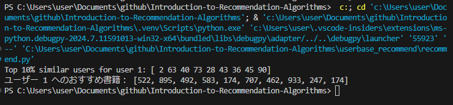

# Introduction-to-Recommendation-Algorithms
レコメンドの基礎を学ぶため協調フィルタリングを実装

# 参考URL
[Pythonで簡単な協調フィルタリングを実装するためのノート](https://qiita.com/hik0107/items/96c483afd6fb2f077985)
[レコメンドアルゴリズム入門：基礎から応用まで実装に必要な知識を解説](https://qiita.com/birdwatcher/items/b60822bdf9be267e1328#%E3%83%87%E3%83%BC%E3%82%BF%E3%81%AE%E7%A8%AE%E9%A1%9E)

## 協調フィルタリングの考え方
step1 そのユーザと他のユーザの **類似度** を計算する
↓
step2 **類似度**の高いユーザーを抽出し、そのユーザーが読んだ書籍を抽出する
↓
step3 抽出した書籍から推奨度の高い書籍を出力する

## メモ
* 協調フィルタリングでは類似度×評価値でランキング順にする考え方
* 類似度はいろいろ工夫の余地があるけど、本プログラムではコサイン類似度で計算
* 推奨度はいろいろ工夫の余地があるけど、今回はサンプルなので適当に1~5で重みづけ（機械学習で重みづけできたらいいなぁ、、、と思ったり）

## 実行方法

usebase_recommend_for_sqliteのあるディレクトリへ移動してから

recommend.pyをpythonつかって実行

実行結果は以下のようになる
